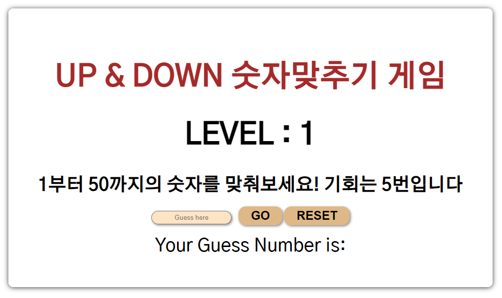

# 🎮 Number Guess Game
> 간단한 숫자맞추기 updown 게임을 해보세요!

updown 숫자맞추기 게임입니다. 
### 보러가기: <https://camac0808.github.io/Number-Guess-Game>

## 프로젝트에 사용된 언어 및 라이브러리

* Javascript ES6

## 프로젝트의 기능 설명

### 1. 매번 달라지는 랜덤한 숫자와 조건문을 활용하여 만든 게임

## 정보

💌메일 – zqzwzazs@gmail.com - gomgom_@naver.com

## 기여 방법

1. (<https://github.com/camac0808/React-project/fork>)을 포크합니다.
2. (`git checkout -b feature/fooBar`) 명령어로 새 브랜치를 만드세요.
3. (`git commit -am 'Add some fooBar'`) 명령어로 커밋하세요.
4. (`git push origin feature/fooBar`) 명령어로 브랜치에 푸시하세요. 
5. 풀리퀘스트를 보내주세요.

<!-- Markdown link & img dfn's -->
[npm-image]: https://img.shields.io/npm/v/datadog-metrics.svg?style=flat-square
[npm-url]: https://npmjs.org/package/datadog-metrics
[npm-downloads]: https://img.shields.io/npm/dm/datadog-metrics.svg?style=flat-square
[travis-image]: https://img.shields.io/travis/dbader/node-datadog-metrics/master.svg?style=flat-square
[travis-url]: https://travis-ci.org/dbader/node-datadog-metrics
[wiki]: https://github.com/yourname/yourproject/wiki
